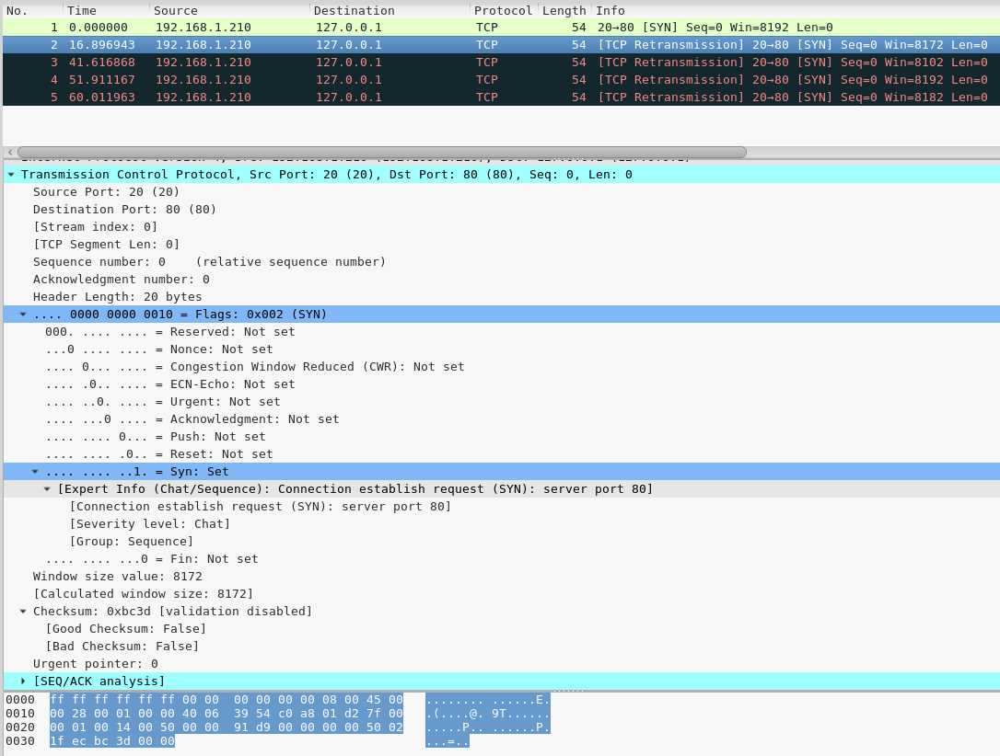

# Covert TCP

Covert channels in the TCP/IP protocol suite. This topic is old but still relevant.

TODO:
- randomize the data sent (look like a spider)
- use SYN-ACK instead of SYN? mimic response traffic (not trigger firewall alert?)
- See code for more TODO's


## Usage examples


### Example: localhost ###

- Watch traffic on localhost, simulated server (must be root)

    tcpdump filter:
    
    SYN flag is set: tcp[13] == 2
    
    ```tcpdump -i lo port 80```
    
    ```tcpdump -i lo tcp[13] == 2```
    
    ```tcpdump -nxxv -i lo 'tcp[13] == 2 && tcp[16:4] > 8188'```
    

- Run covert-client.py using sudo, in another shell

    ```sudo ./covert-client.py```

### Example: client/server ###

- Start server

    On the server receiving the data..
    
    TODO: ```sudo ./covert-server.py```

- Run client using sudo

    Update destination variable in covert-client.py
    
    ```sudo ./covert-client.py```

### Example: client/server using a bounce host ###

TODO:
    

## Packet captures
 



## Scapy Defaults

Scapy tries to use sensible default values for all packet fields.

- IP source is chosen according to destination and routing table
- Checksum is computed
- Source MAC is chosen according to the output interface
- Ethernet type and IP protocol are determined by the upper layer


For more information, http://www.secdev.org/projects/scapy/doc/introduction.html

## Notes

### Useful Scapy stuff ###

Create a SYN packet with the initial sequence number set to 37337. Spoof the src
and send it to 127.0.0.1, i.e. the lo interface.

```p=IP(src='192.168.1.210', dst='127.0.0.1')/TCP(dport=80, flags='S', seq=37337)```


## References

This work was inspired by the following papers.

[1] Craig H. Rowland: Covert Channels in the TCP/IP Protocol Suite (1997)
 
  http://ojphi.org/ojs/index.php/fm/article/view/528/449

[2] Murdoch, Steven J. and Lewis, Stephen: Embedding Covert Channels into TCP/IP (2005)

  http://dx.doi.org/10.1007/11558859_19
  
